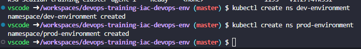

# IAC-DEOPS Environment


## CI / CD Strategy with Jenkins and Docker


### Configure Jekins modules to install in *jenkins/plugins.txt*

### Install Jenkins in local environment.
https://github.com/jenkinsci/docker/
```bash
docker-compose up -d jenkins --build --force-recreate

```


### Create GitHub SSH Key for Jenkins
```bash
ssh-keygen -C "contreras.adr@outlook.com" -f ~/.ssh/jenkins-github
cat ~/.ssh/jenkins-github.
```


## Instalar cluster k3d
```bash
k3d cluster create scalian-training-cluster \
    --api-port 6443 --servers 1 \
    --agents 2 -p 30000-30100:30000-30100@server:0

kubectl cluster-info

kubectl get nodes
```


## Create environments
```bash
kubectl create ns dev-environment
kubectl create ns prod-environment
```


## Install postgresql
## Create environments
```bash
kubectl apply -f postgresql/postgres-pvc.yaml
```
